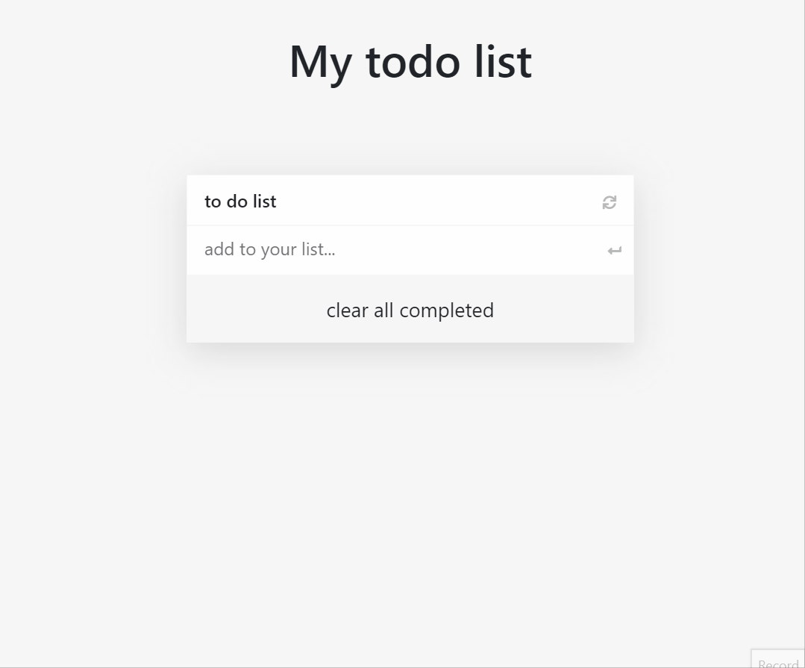
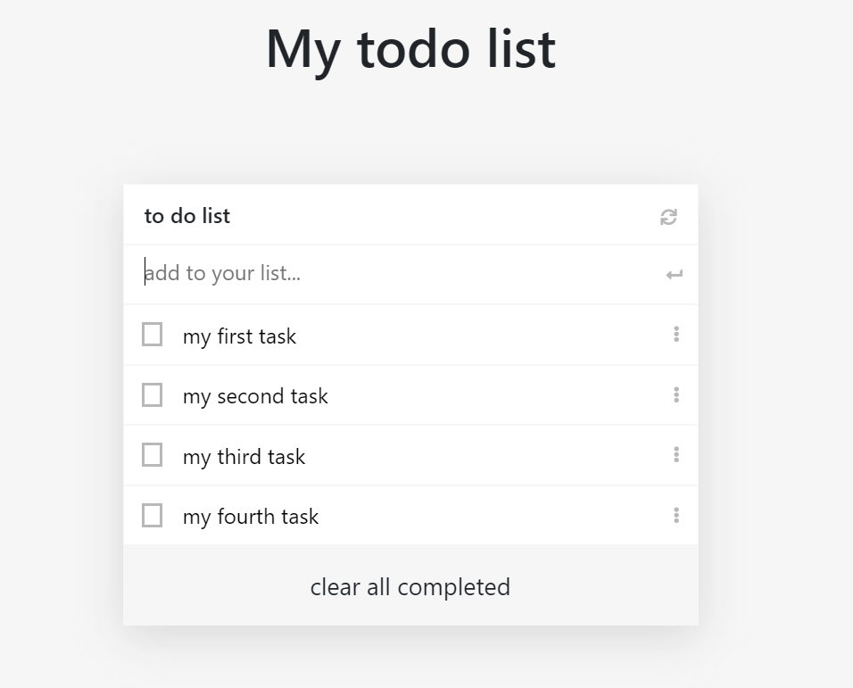

# To Do List

## Description
> creating a simple todo list where u can add new task, edit, delete tasks and delete all completed tasks

Demo view                                |  static view
:---------------------------------------:|:---------------------------------------:
                 |  

## Built With

- html
- css
- javascript
- webpack

## Procedure to clone project
- open your terminal
- type git clone https://github.com/xtrahuman/To-do-list.git
- type cd To-do-list to change directory to the folder of the project
- in your terminal npm install to install app dependencies
- run npm run build in your terminal to build the project.
- navigate to index.html inside the dist directory
- open with live server or type alt l o if live-server is installed in your vscode.

## project link
kindly click the link below to view the website
- website link: [live link](https://xtrahuman.github.io/To-do-list/)

## Author

👤 **Okpara Tochukwu**

- GitHub: [@xtrahuman](https://github.com/xtrahuman)
- Twitter: [@xtrahuman](https://twitter.com/xtrahuman)
- LinkedIn: [LinkedIn](https://linkedin.com/in/tochukwu-okpara-449528197)

## 🤝 Contributing

Contributions, issues, and feature requests are welcome!

Feel free to check the [issues page](../../issues/).

## Show your support

Give a ⭐️ if you like this project!

## 📝 License

This project is [MIT](./MIT.md) licensed.

